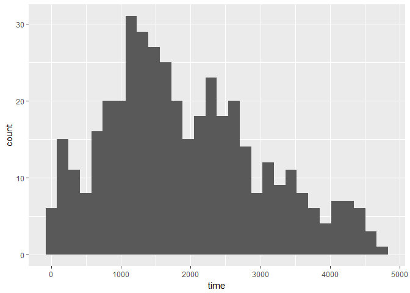
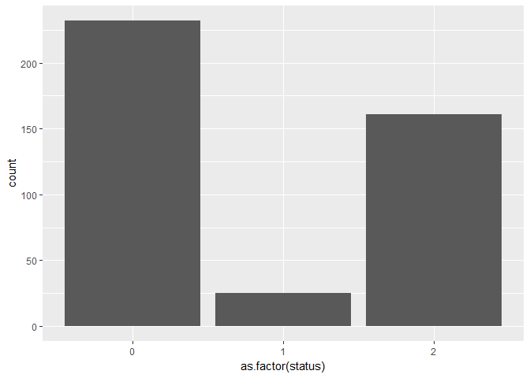
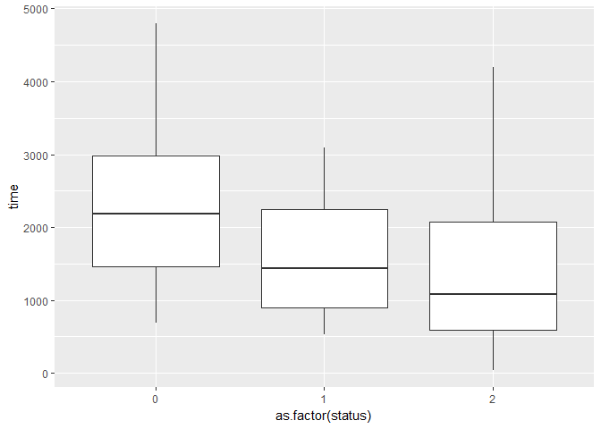
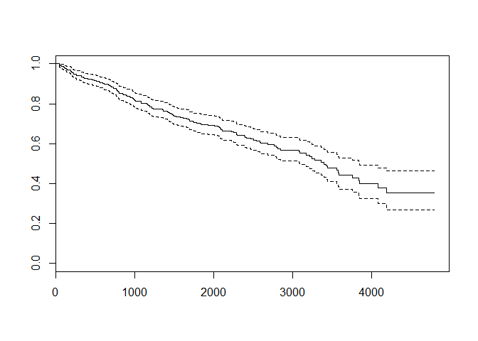
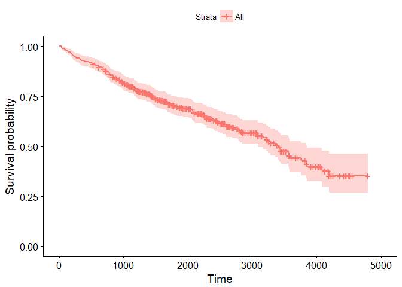
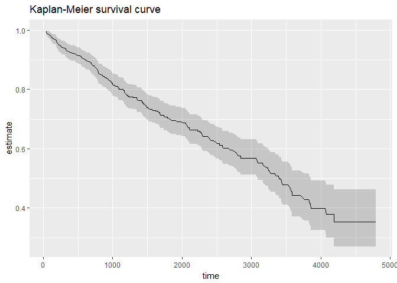
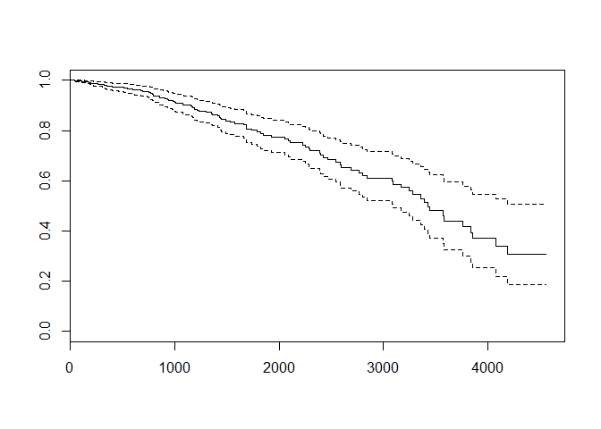
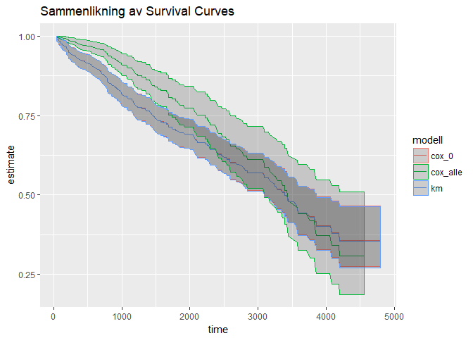

Utforsking av overlevelses-analyse
================

Inspirert av ["Steps to perform survival analysis in R](https://www.r-bloggers.com/steps-to-perform-survival-analysis-in-r/amp/) og MainDonald og Braun (2003) "Data analysis and graphics using R".

Overlevelsesanalyse, eller survival, eller event history analysis er en analyse av tid-til-hendelse (time-to-event). Med denne metoden kan en estimere sannsynligheten for at en hendelse vil inntreffe på tidspunkt T. Det er ikke bare overlevelse eller død dette egner seg for, men de fleste ulike typer hendelse. Det klassiske ikke-sykdomseksempelet ser ut til å være tidspunkt for når en maskin bryter sammen (eller dør, om du vil).

Kort om overlevelsesanalyse
---------------------------

Overlevelsesfunksjonen til en variabel X er definert som sannsynligheten for at variabelen er større enn x. Dette ser ut til å være kjent som et spesialtilfelle av cumulative distribution function. X er gjerne tid, slik at overlevelsesfunksjonen gir sannsynligheten for at en person eller et objekt vil "overleve" lenger enn et gitt tidspunkt, i betydningen ikke få en eller annen status/hendelse, som tar enheten ut av observasjonsrekken.

En kunne sett for seg å løse dette med klassisk regresjon. Men Hastie (2013) beskriver survival analysis som et spesialtilfelle av regresjon for avhengige variabler som kun delvis er observert for noen individer - dvs. data som er "censored". F.eks. kan en se for seg en studie som har fulgt individer fra dag 0 til dag 200. Individ A fikk f.eks. oppvåkning på dag 72. Individ B hadde enda ikke fått noen oppvåkning på dag 200. Denne observasjonen er da "right censored" - vi kjenner ikke forløpet til høyre (på en tidsakse fra venstre mot høyre) for denne enheten, men ønsker fortsatt å bruke informasjonen fra individet i studien. I et datasett for klassisk regresjon ville disse observasjonene vært missing - vi vet jo ikke hvor lenge de faktisk har overlevd.

En del av de samme antakelsene og utfordringene møter denne analyseformen, som klassisk regresjon: antakelser om uavhengige individer, og at censoring er ikke-informativt: det er ingen forskjeller i sannsynlighet for utfallet mellom personer som censoreres og ikke-censoreres

Det er noen ulike teknikker som er relevante:

-   Kaplan-Meier-kurve for å estimere overlevelsesfunksjonen
-   Cox proportional hazard model for å estimere overlevelse med kontinuerlige variabler
-   estimering av survival-funksjon med trær eller forest
-   log-rank-test

Vi bruker pbc-datasettet fra survival-pakken som eksempeldata.

``` r
#survival-pakken er grunnleggende, og kommer med R
library(survival)
suppressPackageStartupMessages(library(tidyverse))

#eksempel-datasettet Primary Biliary Cirrhosis (pbc)
?pbc
```

    ## starting httpd help server ... done

``` r
pbc = pbc
str(pbc)
```

    ## 'data.frame':    418 obs. of  20 variables:
    ##  $ id      : int  1 2 3 4 5 6 7 8 9 10 ...
    ##  $ time    : int  400 4500 1012 1925 1504 2503 1832 2466 2400 51 ...
    ##  $ status  : int  2 0 2 2 1 2 0 2 2 2 ...
    ##  $ trt     : int  1 1 1 1 2 2 2 2 1 2 ...
    ##  $ age     : num  58.8 56.4 70.1 54.7 38.1 ...
    ##  $ sex     : Factor w/ 2 levels "m","f": 2 2 1 2 2 2 2 2 2 2 ...
    ##  $ ascites : int  1 0 0 0 0 0 0 0 0 1 ...
    ##  $ hepato  : int  1 1 0 1 1 1 1 0 0 0 ...
    ##  $ spiders : int  1 1 0 1 1 0 0 0 1 1 ...
    ##  $ edema   : num  1 0 0.5 0.5 0 0 0 0 0 1 ...
    ##  $ bili    : num  14.5 1.1 1.4 1.8 3.4 0.8 1 0.3 3.2 12.6 ...
    ##  $ chol    : int  261 302 176 244 279 248 322 280 562 200 ...
    ##  $ albumin : num  2.6 4.14 3.48 2.54 3.53 3.98 4.09 4 3.08 2.74 ...
    ##  $ copper  : int  156 54 210 64 143 50 52 52 79 140 ...
    ##  $ alk.phos: num  1718 7395 516 6122 671 ...
    ##  $ ast     : num  137.9 113.5 96.1 60.6 113.2 ...
    ##  $ trig    : int  172 88 55 92 72 63 213 189 88 143 ...
    ##  $ platelet: int  190 221 151 183 136 NA 204 373 251 302 ...
    ##  $ protime : num  12.2 10.6 12 10.3 10.9 11 9.7 11 11 11.5 ...
    ##  $ stage   : int  4 3 4 4 3 3 3 3 2 4 ...

PBC-datasettet har 418 observasjoner av 20 variabler. 312 personer deltok i en RCT, mens data ble også samlet om 106 personer til (6 personer falt fra).

-   status: censored (0), transplant (1), dead (2)
-   time: dager mellom registrering og endelig status

``` r
qplot(time,data=pbc)
```

    ## `stat_bin()` using `bins = 30`. Pick better value with `binwidth`.



``` r
qplot(as.factor(status),data=pbc)
```



``` r
qplot(as.factor(status),time,data=pbc,geom="boxplot",group=status)
```



Kaplan-Meier
------------

Starter med Surv()-funksjonen, som lager et survival-objekt som kan brukes som avhengig variabel i en modell. survfit()-funksjonen kan så brukes til å finne Kaplan-Meier-estimatoren og plotte en survival-kurve. (språkbruk?)

``` r
#en kikk på Surv-objektet
pbc_survival = Surv(pbc$time,pbc$status==2)
str(pbc_survival)
```

    ##  Surv [1:418, 1:2]  400  4500+ 1012  1925  1504+ 2503  1832+ 2466  2400    51  ...
    ##  - attr(*, "dimnames")=List of 2
    ##   ..$ : NULL
    ##   ..$ : chr [1:2] "time" "status"
    ##  - attr(*, "type")= chr "right"

``` r
#så survfit
survival_func=survfit(Surv(time,status==2)~1,data=pbc)
survival_func
```

    ## Call: survfit(formula = Surv(time, status == 2) ~ 1, data = pbc)
    ## 
    ##       n  events  median 0.95LCL 0.95UCL 
    ##     418     161    3395    3090    3853

Her får vi ut n, antall positive statuser (død - så språket mister litt mening her etter hvert, når modelleringsspråk kolliderer med vanlige betydninger), median tid-til-event (3 395 dager til død), og 95 % konfidensintervaller rundt medianen. Vi kan plotte funksjonen med base plot.

``` r
plot(survival_func)
#dessverre ingen enkel mulighet for å plott survfit-objektet direkte. Prøver survminer-pakken.
survminer::ggsurvplot(survival_func)
```



``` r
#dette viser seg å være temmelig unødig, det kan likegreit fikses med broom og ggplot2

ggplot(data = broom::tidy(survival_func), aes(x = time, y = estimate))+
  geom_line() +
  geom_ribbon(aes(ymin=conf.low,ymax=conf.high),alpha=0.2)+
  ggtitle("Kaplan-Meier survival curve")
```



Y-aksen viser sannsynlighet for overlevelse (ikke oppleve status==2), mens x-aksen viser tid i dager. Sannsynligheten for å overleve går ned med tid (og sannsynligheten for å dø går opp). F.eks. er sannsynligheten for å overleve mer enn 1000 dager ca. 80 %.

Denne bygger på antakelsen om at individene er uavhengige, og er en estimering av den underliggende overlevelsesfunksjonen, som teoretisk sett er glatt.

Cox proportional hazard model
-----------------------------

Forskjellen mellom survfit()/Kaplan-Meier og Cox Proportional Hazard Model er...

Cox-modellen aksepterer ikke missing-verdier.

``` r
#kan estimere en cox-model med kun intercept også
cox_model = coxph(Surv(time,status==2)~1,data=pbc)
summary(cox_model)
```

    ## Call:  coxph(formula = Surv(time, status == 2) ~ 1, data = pbc)
    ## 
    ## Null model
    ##   log likelihood= -873.4721 
    ##   n= 418

``` r
#for å lage en survival kurve fra en cox-model må den mates inn i survfit()
cox_curve_0 = survfit(cox_model)
cox_curve_0
```

    ## Call: survfit(formula = cox_model)
    ## 
    ##       n  events  median 0.95LCL 0.95UCL 
    ##     418     161    3395    3090    3853

``` r
plot(cox_curve_0)
```


Men cox-modellen kan også brukes til å estimere en modell. Her er en enkel kjøkkenvask-modell (alle variabler som uavhengige variabler) for pbc-datasettet.

``` r
cox_model = coxph(Surv(time,status==2)~.,data=pbc)
summary(cox_model)
```

    ## Call:
    ## coxph(formula = Surv(time, status == 2) ~ ., data = pbc)
    ## 
    ##   n= 276, number of events= 111 
    ##    (142 observations deleted due to missingness)
    ## 
    ##                coef  exp(coef)   se(coef)      z Pr(>|z|)   
    ## id       -2.729e-03  9.973e-01  1.462e-03 -1.866  0.06203 . 
    ## trt      -1.116e-01  8.944e-01  2.156e-01 -0.518  0.60476   
    ## age       3.191e-02  1.032e+00  1.200e-02  2.659  0.00784 **
    ## sexf     -3.822e-01  6.824e-01  3.074e-01 -1.243  0.21378   
    ## ascites   6.321e-02  1.065e+00  3.874e-01  0.163  0.87038   
    ## hepato    6.257e-02  1.065e+00  2.521e-01  0.248  0.80397   
    ## spiders   7.594e-02  1.079e+00  2.448e-01  0.310  0.75635   
    ## edema     8.860e-01  2.425e+00  4.078e-01  2.173  0.02980 * 
    ## bili      8.038e-02  1.084e+00  2.539e-02  3.166  0.00155 **
    ## chol      5.151e-04  1.001e+00  4.409e-04  1.168  0.24272   
    ## albumin  -8.511e-01  4.270e-01  3.114e-01 -2.733  0.00627 **
    ## copper    2.612e-03  1.003e+00  1.148e-03  2.275  0.02290 * 
    ## alk.phos -2.623e-05  1.000e+00  4.206e-05 -0.624  0.53288   
    ## ast       4.239e-03  1.004e+00  1.941e-03  2.184  0.02894 * 
    ## trig     -1.228e-03  9.988e-01  1.334e-03 -0.920  0.35741   
    ## platelet  7.272e-04  1.001e+00  1.177e-03  0.618  0.53660   
    ## protime   1.895e-01  1.209e+00  1.128e-01  1.680  0.09289 . 
    ## stage     4.468e-01  1.563e+00  1.784e-01  2.504  0.01226 * 
    ## ---
    ## Signif. codes:  0 '***' 0.001 '**' 0.01 '*' 0.05 '.' 0.1 ' ' 1
    ## 
    ##          exp(coef) exp(-coef) lower .95 upper .95
    ## id          0.9973     1.0027    0.9944     1.000
    ## trt         0.8944     1.1181    0.5862     1.365
    ## age         1.0324     0.9686    1.0084     1.057
    ## sexf        0.6824     1.4655    0.3736     1.246
    ## ascites     1.0653     0.9387    0.4985     2.276
    ## hepato      1.0646     0.9393    0.6495     1.745
    ## spiders     1.0789     0.9269    0.6678     1.743
    ## edema       2.4253     0.4123    1.0907     5.393
    ## bili        1.0837     0.9228    1.0311     1.139
    ## chol        1.0005     0.9995    0.9997     1.001
    ## albumin     0.4270     2.3422    0.2319     0.786
    ## copper      1.0026     0.9974    1.0004     1.005
    ## alk.phos    1.0000     1.0000    0.9999     1.000
    ## ast         1.0042     0.9958    1.0004     1.008
    ## trig        0.9988     1.0012    0.9962     1.001
    ## platelet    1.0007     0.9993    0.9984     1.003
    ## protime     1.2086     0.8274    0.9690     1.508
    ## stage       1.5634     0.6397    1.1020     2.218
    ## 
    ## Concordance= 0.849  (se = 0.031 )
    ## Rsquare= 0.462   (max possible= 0.981 )
    ## Likelihood ratio test= 171.3  on 18 df,   p=0
    ## Wald test            = 172.5  on 18 df,   p=0
    ## Score (logrank) test = 286.1  on 18 df,   p=0

``` r
cox_curve = survfit(cox_model)
plot(cox_curve)
```



Hvordan skal survival-plottet her forstås? Det er fortsatt avtakende sannsynlighet for overlevelse med tid, men med større konfidensintervaller mot slutten (naturlig, ettersom nesten halvparten av observasjonene faller bort som missing). Men for hvilke verdier av de uavhengige variablene? De faktiske verdiene?

Survival in the forest
----------------------

Litt usikker på hva som vil være fordeler og ulemper med å benytte trær og random forest-estimering her, så lar det ligge til jeg har forstått det grunnleggende ellers. Et grunnleggende skille vil jo være at cox-regresjon antar en lineær modell, mens trær ikke gjør det.

Sammenligning av modeller
-------------------------

``` r
#kunne vært en ide å bruke broom her for å rydde litt...?
#merk at det som i survfit-objektet er surv, er estimate i broom-dfen
test = data.frame(cox_curve$surv,broom::tidy(cox_curve)$estimate)
head(test)
```

    ##   cox_curve.surv broom..tidy.cox_curve..estimate
    ## 1      0.9992460                       0.9992460
    ## 2      0.9983887                       0.9983887
    ## 3      0.9974917                       0.9974917
    ## 4      0.9965868                       0.9965868
    ## 5      0.9956642                       0.9956642
    ## 6      0.9947402                       0.9947402

``` r
#setter de sammen
modeller = bind_rows(cox_0 = broom::tidy(cox_curve_0),cox_alle = broom::tidy(cox_curve),km = broom::tidy(survival_func),.id="modell")

ggplot(data = modeller, aes(x = time, y = estimate, color = modell))+
  geom_line() +
  geom_ribbon(aes(ymin=conf.low,ymax=conf.high),alpha=0.2)+
  ggtitle("Sammenlikning av Survival Curves")
```



Cox-modellen med alle variablene har en høyere sannsynlighet for overlevelse i starten, men den faller brattere, og har større konfidensintervaller. Null-modellen med cox er så godt som lik Kaplan-Meier-kurven.
